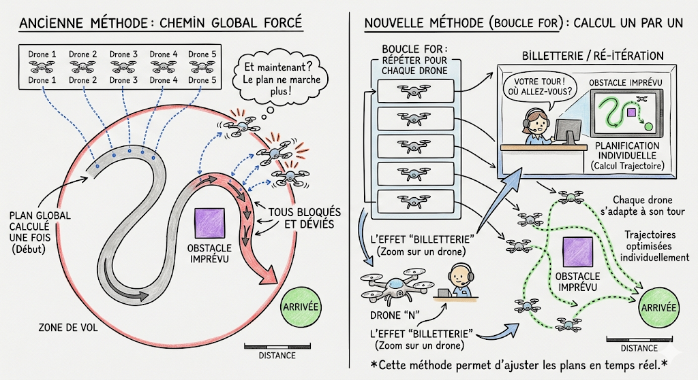
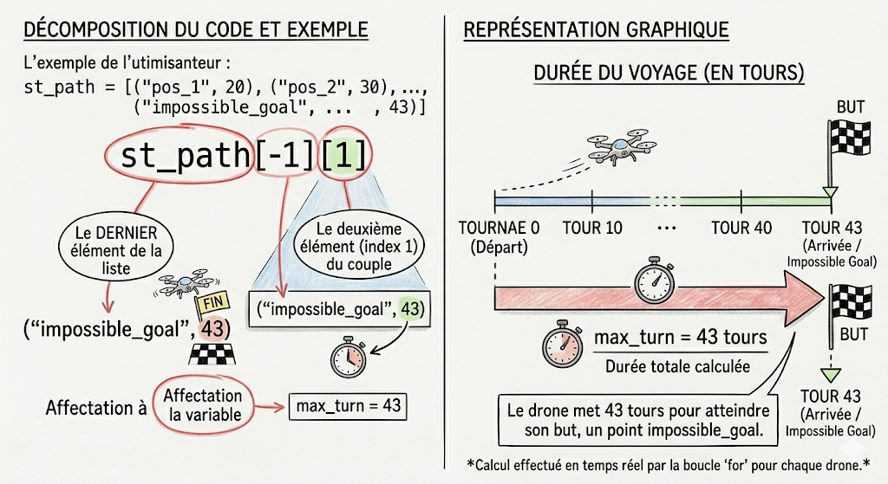

logique de resoltuion.

SIMULATOR.PY

Logic de résolution : init_drone
Cette méthode a pour but de préparer physiquement la simulation : elle crée les drones un par un et les positionne tous sur la ligne de départ de la carte avant que le moindre calcul d'A* ne commence.

1. Vérifications de sécurité (Guard Rails)
Avant de lancer la création, le code vérifie que la carte possède bien toutes les informations nécessaires :

On récupère le nombre total de drones prévus pour la map dans une variable nb_drone. Si cette variable est vide (None), le programme lève une erreur (ValueError) pour éviter de planter plus tard.

On récupère la zone de départ du graphe dans start_zone. Si elle n'est pas définie, le programme s'arrête également avec une erreur car on ne saurait pas où placer les drones.

2. La boucle de création : for n in range(1, nb_drone + 1):
On lance une boucle qui va itérer de 1 jusqu'au nombre total de drones (par exemple de 1 à 25). À chaque tour, elle effectue trois actions cruciales pour le drone numéro n :

self.trajectory[f'D{n}'] = [] : On initialise une liste vide dans le dictionnaire des trajectoires réelles pour ce drone (ex: 'D1'). C'est ici que le simulateur enregistrera l'historique de ses vraies positions physiques au fur et à mesure de la course.

self.drones_id[f"D{n}"] = Drone(f"D{n}", start_zone) : C'est l'instanciation. On crée le véritable objet Drone en lui donnant son identifiant textuel (ex: "D1") et sa zone de départ (start_zone). On stocke cet objet dans le dictionnaire central self.drones_id (celui que l'A* utilisera juste après dans init_run).

start_zone.current_drones += 1 : On incrémente le compteur de drones présents physiquement sur la case de départ. Si on a 25 drones, à la fin de la boucle, la zone "start" saura qu'elle contient exactement 25 drones à l'état initial.

init_run:
dans la methode init_run fichier simulator.py je creer une boucle for pour calculer le chemin avec l algorythme astar de chaque drone 1 par 1.

2- J'incremente une autre boucle for dans la precedente qui permettra de stocker dans space_time_reservation[(zone_name, turn)], dans qu elle zone sera le drone a x tour.

3-On stock dans une variable (max_turn: int) pour connaitre le nombre de tour aue doit faire pour arriver à destination.
Pour ce faire : max_turn = st_path[-1][1] -> [-1] Correspond au dernier élément du tableau
                                              [1] Correspond au deuxieme element, c'est-à-dire le numéro du tour. Ici, c'est 43.

Mais aussi une autre variable (timeline: List[str]):
timeline: List[str] = [self.graph.start_zone.name] * (max_turn + 1) : Créer l'agenda vide
self.graph.start_zone.name : C'est le nom de ta case de départ (la chaîne de caractères "start").

[...] * (max_turn + 1) : En Python, multiplier une liste par un nombre va dupliquer son contenu. Si max_turn vaut 43, on fait 43 + 1 = 44. On crée donc une liste contenant 44 fois le mot "start".

À quoi ça sert ? Cela crée un tableau qui ressemble à ça :
["start", "start", "start", "start", ... (44 fois) ...]

Cette liste preremplie à la taille de max_turn + 1 qui servira a stocker tous les noms de zone dans lequelle le drone sera passer.

3- for i in range(len(st_path) - 1):
                z_curr, t_curr = st_path[i]
                z_next, t_next = st_path[i + 1]

                for t in range(t_curr, t_next):
                    if (t_next - t_curr) == 2 and t == t_curr:
                        conn_name = ""
                        for conn in self.graph.get_neighbors(self.graph.dict_zones[z_curr]):
                            if conn.zone_a.name == z_next or conn.zone_b.name == z_next:
                                conn_name = conn.name
                                break
                        timeline[t + 1] = conn_name
                    else:
                        timeline[t + 1] = z_next

            drone.path = timeline
Cette boucle permet de remplir timeline: List[str]

run_drone:
1- max_turns = max(len(d.path) for d in self.drones_id.values()) est une boucle de comprehtion permettant de stocker dans la variable (max_turn)le plus grand nombre de tour qu'un des drone doit faire pour arrivee jusqu'a destination 

2- for turn in range(1, max_turns):
            moves: List[str] = [] -> liste de tous les mouvement fait en un tour. ex: moves = ["D1-gate_hell1", "D2-gate_hell2", "D5-maze_loop1"]

            for d_id, drone in self.drones_id.items():
                if turn >= len(drone.path):
                    continue

                current_pos = drone.path[turn]
                prev_pos = drone.path[turn - 1]

                if current_pos != prev_pos:
                    if prev_pos == self.graph.end_zone.name:
                        continue
                    moves.append(f"{d_id}-{current_pos}")

            if moves:
                self.stock_turns.append(moves)

faire une boucle qui itere les tours et dans chaque tour parcourir tous les drone en mettant les conditions suivante:
- if turn >= len(drone.path): si le tour actuel est plus grand que la longueur du chemin du drone, passe au drone suivant cela signifie qu il est deja arriver et evite un crash.
Assigne à la variable (current_pos) la zone auquelle il a été attribuer au x eme tour(la position )
Assigne à la variable (prev_pos) la zone auquelle le drone été attribuer au tour d'avant 
si la position actuelle est different de la precedente et qu il n est pas arrivee à destination ajoute ldans la liste (moves: List[str] = [])
la derniere condition (if moves) permet de securiser  l'enregistrement dans stock_turn
Une fois que (move) à enregistrer les chemins de tout les drone 

🎯 En résumé pour ton document global
init run permet d assigner le chemin pour chaque drone et run_drone permet d afficher en output tous les chemin securisant les cqs specifique de chaue
init_drone permet d'initialiser et de matérialiser la flotte de drones sur la case de départ ("start"), préparant ainsi les structures de données (drones_id et trajectory) pour que init_run puisse ensuite planifier leurs agendas temporels.